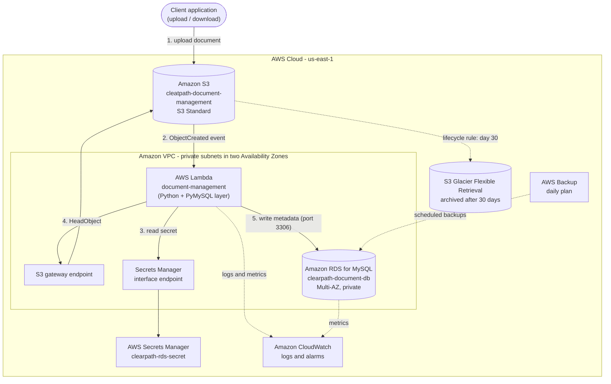

# Document Management and Client Records Platform

A serverless AWS platform that stores business and client documents in Amazon S3, automatically records each document's metadata in a searchable Amazon RDS for MySQL database, archives older files to lower-cost storage, and protects the database with scheduled backups.

This repository contains the complete Infrastructure as Code (Terraform), the Lambda function, and the build tooling needed to reproduce the environment.

> **About this repository.** The reference environment was first built by hand in the AWS Console. The Terraform in this repo is a codified definition of that same architecture, so it can be reviewed, version-controlled, and redeployed consistently. See [Adopting the existing console-built environment](#adopting-the-existing-console-built-environment) if you want Terraform to manage the resources that already exist.

---

## Architecture



### How it works

1. A client uploads a document to the S3 bucket (stored in S3 Standard, encrypted with SSE-S3, versioning on, public access blocked).
2. S3 emits an `ObjectCreated` event that invokes the `document-management` Lambda function.
3. The function, running in private subnets, fetches the database credentials from AWS Secrets Manager through a VPC interface endpoint. No credentials are stored in code or configuration, and no internet access is needed.
4. The function reads the object's details from S3 through a VPC gateway endpoint.
5. The function writes the metadata (file name, S3 key, size, storage class, upload timestamp) to the `document_management_db` database on the Multi-AZ RDS instance.
6. An S3 Lifecycle rule transitions objects to S3 Glacier Flexible Retrieval 30 days after creation to reduce long-term storage cost.
7. AWS Backup takes a daily backup of the RDS instance; CloudWatch collects logs and raises alarms.

The same function can also return a time-limited pre-signed download URL and list recent metadata rows (see [Using the platform](#using-the-platform)).

### Components

| Service | Resource | Purpose |
|---|---|---|
| Amazon S3 | `cleatpath-document-management` | Document storage, versioned and encrypted |
| S3 Lifecycle | `archive-to-glacier-flexible-retrieval` | Move objects to Glacier Flexible Retrieval after 30 days |
| AWS Lambda | `document-management` | Event-driven metadata capture, pre-signed URLs |
| Lambda layer | `cleatpath-pymysql` | PyMySQL client library |
| Amazon RDS for MySQL | `clearpath-document-db` / `document_management_db` | Searchable metadata repository (Multi-AZ, private) |
| AWS Secrets Manager | `clearpath-rds-secret` | Database credentials |
| Amazon VPC | `cleatpath-vpc` + 2 private subnets | Network isolation for Lambda and RDS |
| VPC endpoints | Secrets Manager (interface), S3 (gateway) | Private access to AWS APIs without a NAT gateway |
| Security groups | `ClearPath-RDS-SG` and two others | Least-privilege network rules (see below) |
| AWS IAM | `document-management-lambda-role` | Lambda execution role |
| AWS Backup | `cleatpath-backup-vault`, daily plan | Scheduled RDS backups, 30-day retention |
| Amazon CloudWatch | Log group + 4 alarms + SNS topic | Logging, monitoring, alerting |

### Confirmed resource names

| Setting | Value |
|---|---|
| Region | `us-east-1` |
| S3 bucket | `cleatpath-document-management` |
| S3 lifecycle | Transition after 30 days to Glacier Flexible Retrieval |
| Lambda function | `document-management` (Python, PyMySQL layer) |
| Lambda IAM role | `document-management-lambda-role` |
| RDS identifier | `clearpath-document-db` |
| Database name | `document_management_db` |
| DB username | `admin` |
| RDS instance / storage | `db.t3.micro`, 20 GB gp3, Multi-AZ, private, port 3306 |
| RDS security group | `ClearPath-RDS-SG` |
| Secret | `clearpath-rds-secret` |

Names for the remaining resources (VPC, subnets, the Lambda and endpoint security groups, backup vault/role, SNS topics) are derived from the `project_name` variable and may differ from what you see in the console. Every name above is a variable, so you can change any of them.

---

## Repository structure

```
.
├── README.md
├── terraform/
│   ├── versions.tf             # Terraform + provider versions, provider config
│   ├── variables.tf            # All inputs, defaulted to the reference deployment
│   ├── network.tf              # VPC, private subnets, route table, VPC endpoints
│   ├── security_groups.tf      # Security groups and rules
│   ├── s3.tf                   # Bucket, encryption, lifecycle, S3 -> Lambda event
│   ├── secrets.tf              # Generated DB password + Secrets Manager secret
│   ├── rds.tf                  # RDS for MySQL (Multi-AZ, private)
│   ├── lambda.tf               # IAM role, layer, function, log group
│   ├── monitoring.tf           # CloudWatch alarms + SNS alerts
│   ├── backup.tf               # AWS Backup vault, plan, role, notifications
│   ├── outputs.tf
│   └── terraform.tfvars.example
├── src/
│   └── handler.py              # Lambda function code
├── scripts/
│   └── build_layer.sh          # Builds the PyMySQL Lambda layer
├── build/                      # Generated zip files (git-ignored)
└── .github/workflows/
    └── terraform-validate.yml  # CI: terraform validate + Python compile check
```

---

## Deployment

### Prerequisites

- [Terraform](https://developer.hashicorp.com/terraform/install) 1.5 or later
- [AWS CLI v2](https://docs.aws.amazon.com/cli/latest/userguide/getting-started-install.html), configured for the target account
- Python 3.9+ with `pip`, and `zip` (used to build the Lambda layer)
- An AWS identity allowed to create the resources in this repo: VPC and EC2 networking, S3, RDS, Lambda, IAM roles, Secrets Manager, CloudWatch, SNS and AWS Backup. Review the permissions with your account owner rather than defaulting to administrator access.

### Steps

**1. Confirm you are pointed at the right AWS account.** Terraform deploys to whichever account your active credentials belong to.

```bash
aws sts get-caller-identity
```

**2. Build the Lambda layer.**

```bash
./scripts/build_layer.sh
```

This creates `build/pymysql_layer.zip`.

**3. (Optional) Set your variables.**

```bash
cd terraform
cp terraform.tfvars.example terraform.tfvars
# edit terraform.tfvars (for example, set alert_email)
```

S3 bucket names are global. If `cleatpath-document-management` is already taken, set a different `document_bucket_name`.

**4. Initialise, review, and apply.**

```bash
terraform init
terraform fmt
terraform validate
terraform plan -out=tfplan
terraform apply tfplan
```

Commit the generated `.terraform.lock.hcl` file so provider versions stay pinned.

**5. Confirm the alert subscription.** If you set `alert_email`, AWS sends two confirmation emails (alarms and backups). Click the links to start receiving notifications.

### State

Terraform state contains the generated database password. Do not commit it. For anything beyond a trial run, use the encrypted S3 backend block in `terraform/versions.tf` (an S3 bucket with versioning and a DynamoDB lock table, created beforehand).

---

## Using the platform

**Upload a document** (this triggers the whole flow):

```bash
aws s3 cp ./sample.pdf s3://cleatpath-document-management/sample.pdf
```

**Check the function ran** (look for "Stored metadata for 1 object(s)"):

```bash
aws logs tail /aws/lambda/document-management --since 10m
```

**List recent metadata rows** (the database is private, so query it through the function):

```bash
aws lambda invoke \
  --function-name document-management \
  --cli-binary-format raw-in-base64-out \
  --payload '{"action":"list_documents"}' out.json && cat out.json
```

**Get a pre-signed download URL:**

```bash
aws lambda invoke \
  --function-name document-management \
  --cli-binary-format raw-in-base64-out \
  --payload '{"action":"get_download_url","object_key":"sample.pdf"}' out.json && cat out.json
```

### Retrieving archived documents

Objects older than 30 days are stored in **S3 Glacier Flexible Retrieval**, which is not instant. An archived object must be restored before it can be downloaded. The function returns an HTTP 409 with instructions if you ask for a URL to an archived object that has not been restored.

```bash
aws s3api restore-object \
  --bucket cleatpath-document-management \
  --key sample.pdf \
  --restore-request '{"Days":7,"GlacierJobParameters":{"Tier":"Standard"}}'
```

| Restore tier | Typical time |
|---|---|
| Expedited | 1 to 5 minutes |
| Standard | 3 to 5 hours |
| Bulk | 5 to 12 hours |

---

## Security design

- **Private by default.** RDS has no public endpoint. Lambda and RDS live in private subnets with no internet gateway or NAT gateway.
- **No hard-coded credentials.** The database password is generated by Terraform, stored in Secrets Manager, and read by Lambda at runtime through a private VPC endpoint.
- **Least-privilege networking.** RDS accepts port 3306 only from the Lambda security group. Lambda may only reach RDS (3306), the Secrets Manager endpoint (443) and S3 (443). The endpoint accepts 443 only from Lambda.
- **Least-privilege IAM.** The Lambda role can read objects in this one bucket and read this one secret, plus the AWS-managed VPC/logging policy.
- **Data protection.** S3 versioning, SSE-S3 encryption and Block Public Access; RDS storage encryption; the S3 event is restricted to this account and bucket.
- **Resilience.** RDS Multi-AZ, RDS automated backups (7 days), and AWS Backup daily recovery points (30 days).

## Monitoring

CloudWatch alarms notify the `<project>-alerts` SNS topic when:

| Alarm | Condition |
|---|---|
| Lambda errors | Any error in a 5-minute period |
| Lambda duration | Average above 10 seconds |
| RDS CPU | Above 80% for 10 minutes |
| RDS free storage | Below 2 GB |

AWS Backup publishes job-completed and job-failed events to `<project>-backup-notifications`.

---

## Adopting the existing console-built environment

If the resources already exist in your account, applying this configuration as-is will fail on name conflicts. To have Terraform manage them, import each existing resource into state first, then run `terraform plan` and resolve any differences before applying. For example:

```bash
cd terraform
terraform import aws_s3_bucket.documents cleatpath-document-management
terraform import aws_db_instance.metadata clearpath-document-db
terraform import aws_lambda_function.document_management document-management
terraform import aws_iam_role.lambda document-management-lambda-role
terraform import aws_secretsmanager_secret.db_credentials <secret-arn>
```

Resources whose names are derived from `project_name` (VPC, subnets, some security groups) must be imported by ID, or their name variables adjusted to match the console. Expect the first plan to show differences; treat each one as a decision (change the code or change the resource), not something to apply blindly.

## Teardown

1. Set `rds_deletion_protection = false` and run `terraform apply`.
2. Empty the S3 bucket, including all object versions (Terraform will not delete a non-empty bucket).
3. Run `terraform destroy`. A final RDS snapshot named `<db-identifier>-final-snapshot` is taken.
4. Deleted secrets stay recoverable for `secret_recovery_window_days` (default 7), which blocks re-creating a secret with the same name. Set it to `0` before destroying if you need to redeploy immediately.

## Known limitations and next steps

- `src/handler.py` is a reference implementation of the behaviour described above. Compare it with the function deployed in your environment before treating them as identical.
- There is no end-user API yet. A natural next step is Amazon API Gateway plus a web or mobile front end for upload, search and retrieval.
- The metadata table is created by the function on first run. For larger deployments, manage schema changes with a migration tool.
- AWS Backup protects the RDS database. Documents in S3 are protected by versioning; add an S3 backup selection or cross-region replication if you need stronger recovery guarantees.
- Estimate costs with the [AWS Pricing Calculator](https://calculator.aws/) using your real document volume. The main drivers are the Multi-AZ RDS instance, S3 storage, and the Secrets Manager secret and interface endpoint.
